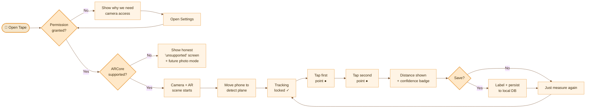
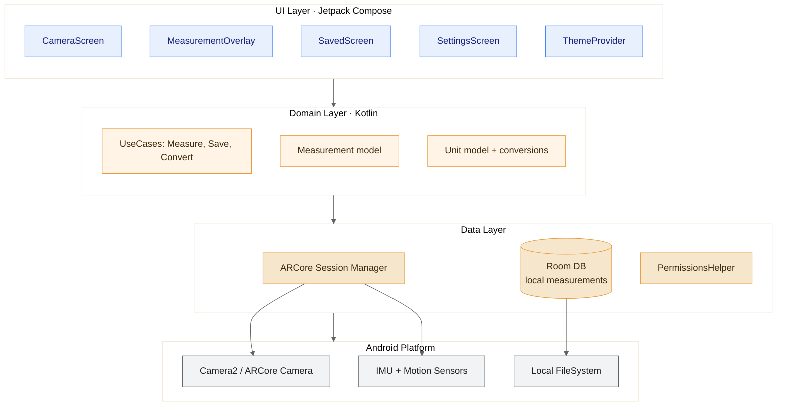
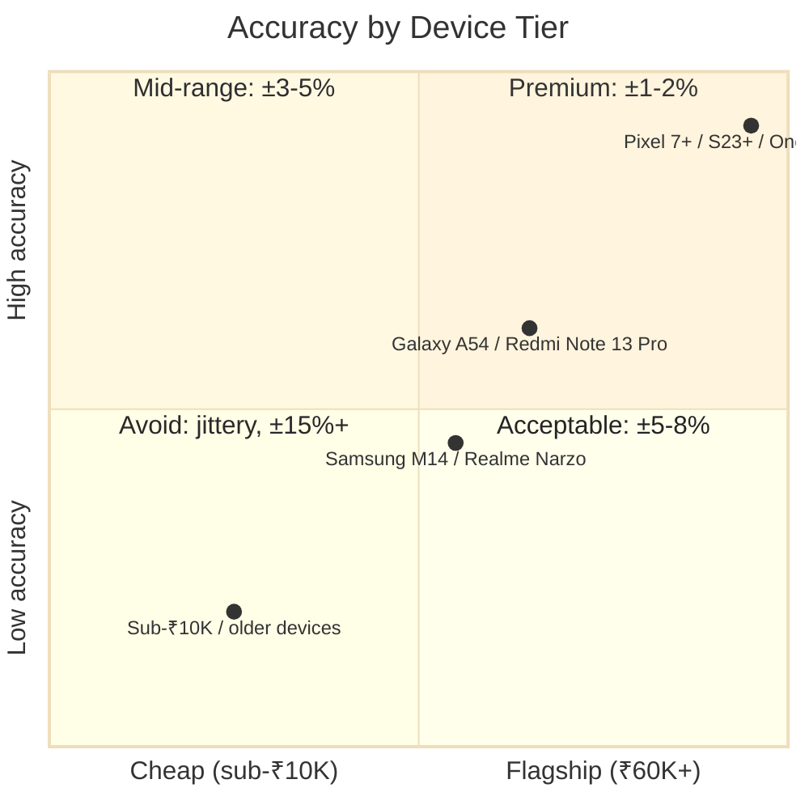
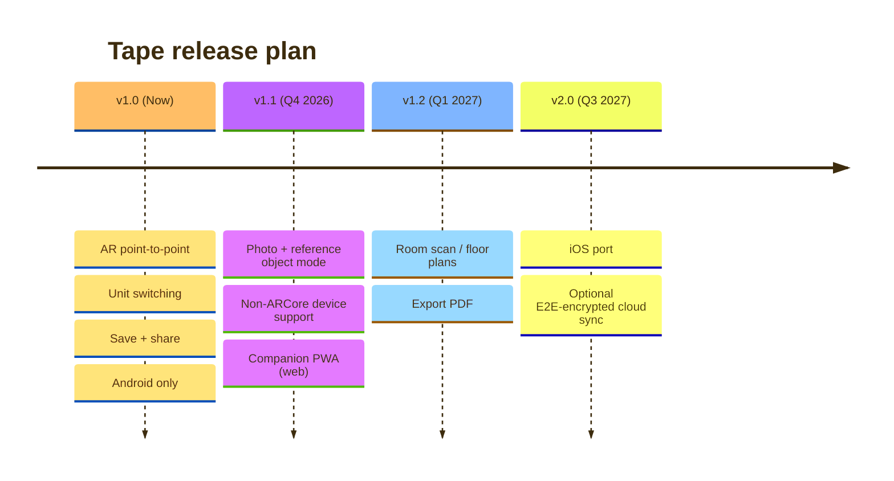
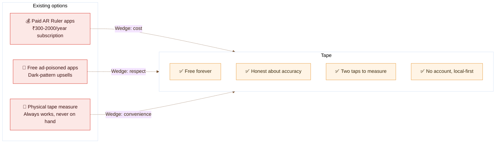

<div align="center">


# Tape

**Measure anything, with your phone. Free.**

A free, ad-free AR measurement app for Android. Point your camera at two points, tap them, get the distance between them.

[Features](#what-it-does) • [Why it exists](#why-this-exists) • [Architecture](#architecture) • [Roadmap](#roadmap) • [Build it yourself](#building-locally)

<br />

[](#)
[](#)
[](LICENSE)
[](https://kotlinlang.org)
[](https://developers.google.com/ar)
[](https://developer.android.com/jetpack/compose)
[](#roadmap)

<br />

> **⚠️ Pre-alpha.** Tape is in active planning. See [`.hermes/plans/`](.hermes/plans/) for Discovery, design brief, and execution plan.

</div>

---

## Why this exists

iOS has had a built-in **Measure** app since 2018. **Android doesn't.** Your only options are:

- Buy a physical tape measure (₹50–200 — fine, not always on hand)
- Pay for an AR app (₹300–2,000/year, basic features locked behind subscription)
- Use a free AR app (stuffed with ads and dark-pattern upsells; reviews are brutal)
- Eyeball it from a photo (works for some things, needs a known reference object)

Android has ~600 million active users in India alone. The "measure two points" workflow shouldn't require money or a tolerance for dark patterns. **Tape fixes that.**

## How it works (v1)



Two taps. One distance. Zero friction.

## What it does (v1)

- **AR point-to-point distance** — tap two points in camera view, get the distance
- **Floor / wall plane detection** — auto-detects horizontal and vertical surfaces
- **Unit switching** — cm, m, in, ft (tap to cycle, or set default in settings)
- **Save measurements** — label them, persist locally on-device
- **Share** — share a measurement as text or image
- **Confidence indicator** — honest "high / medium / low accuracy" badge based on device capability
- **Offline-first** — works without internet, no account, no cloud

## What it doesn't do (v1)

| Out of scope for v1 | Planned for |
|---|---|
| Room scanning / floor plans | v1.2 |
| Person height estimation | v2.x |
| Photo + reference object mode | v1.1 |
| Cloud sync / accounts | v2.0 (optional, E2E encrypted) |
| iOS port | v2.0 |
| Subscriptions / in-app purchases | **never** |

## Real-world use cases

| Use case | Why Tape helps |
|---|---|
| **Buying furniture online** | "Will this sofa fit through my door?" — measure the door before checkout |
| **Apartment hunting** | "Is the room big enough for my bed + desk + wardrobe?" — measure before visiting |
| **Home renovation** | "How much paint / tiles / flooring do I need?" — measure walls / floor |
| **Moving houses** | "Will this fit in my car / elevator?" — measure first |
| **DIY / handyman work** | Quick checks without grabbing a physical tape |
| **OLX / Facebook Marketplace listings** | Show actual dimensions in your listing photo or description |
| **Students / engineers** | Measure scale models, prototypes, technical objects |
| **Tailoring (informational)** | Quick body measurements for online tailoring |

## Architecture



**Why native Kotlin (not Flutter / React Native):** ARCore is a native Android SDK. Flutter AR plugins are community-maintained, lag ARCore releases, and have known accuracy/stability issues vs native. For a measurement app where **accuracy IS the product**, betting on third-party AR plugins is a real risk. We go native.

## Accuracy — honest breakdown



**Tape shows this confidence level live** so users know when to trust a measurement and when to grab a physical tape.

## Roadmap



## Design principles

1. **One job, done well.** Measurement. That's it.
2. **Free forever.** No subscription, no premium tier, no upsells.
3. **Honest about accuracy.** Show confidence. Explain why a measurement might be off.
4. **Respect the user's time.** Tap two points. Get the number. No tutorial walls.
5. **Respect the user's data.** No account. No analytics on what you measure. Local-first.

## Why Tape vs the existing alternatives



## Repo layout

```
Tape/
├── app/                      # Android app module (coming in v1.0)
│   ├── src/main/java/        # Kotlin sources
│   ├── src/main/res/         # Resources, layouts, icons
│   └── src/test/             # Unit tests
├── docs/                     # Design assets
│   ├── tape-prototype.html   # Interactive v1 prototype (open in browser)
│   └── tape-ar-variations.html # AR measurement treatment comparison
├── .hermes/
│   └── plans/                # Discovery, design brief, execution plan (public)
├── gradle/                   # Gradle wrapper
├── README.md                 # ← you are here
├── LICENSE                   # MIT
└── CONTRIBUTING.md           # Coming soon
```

## Design prototype

Two HTML files in [`docs/`](docs/) ship the high-fidelity design:

- **[`docs/tape-prototype.html`](docs/tape-prototype.html)** — interactive prototype of all v1 screens (welcome, permission, camera + AR measurement, saved list, settings, etc.). Open in a browser, click around. Includes dark/light theme, density switcher, confidence display mode, grid/notes toggles, phone/tablet switcher.
- **[`docs/tape-ar-variations.html`](docs/tape-ar-variations.html)** — side-by-side comparison of three AR measurement treatments (Minimal / Ambient Grid / Confidence-Forward). Pick the default before code starts.

**Recommended default:** Confidence-Forward (Variation 1c). It leads with the ±% tolerance — the honesty wedge that no competitor has.

## Tech stack

| Layer | Choice | Why |
|---|---|---|
| Language | **Kotlin 2.0+** | First-class Android, coroutines, null safety |
| UI | **Jetpack Compose** | Modern declarative UI, less XML, better state mgmt |
| AR | **ARCore** (Google) | Native, best Android AR accuracy |
| Min SDK | **24 (Android 7.0)** | Covers ~97% of active devices |
| Target SDK | **35 (Android 15)** | Required for Play Store submissions in 2026 |
| DB | **Room** | Type-safe SQLite, no cloud needed for v1 |
| DI | **Hilt** | Standard Android DI |
| Async | **Coroutines + Flow** | Idiomatic Kotlin concurrency |
| Testing | **JUnit5 + MockK + Compose UI Test** | Standard Android testing stack |
| Build | **Gradle (Kotlin DSL)** | Modern, type-safe build scripts |

## Building locally

Pre-alpha — these steps will become valid once v1.0 code lands.

```bash
# Clone
git clone https://github.com/Akshay2996/Tape.git
cd Tape

# Open in Android Studio Hedgehog or later
# File → Open → select the project root

# Build
./gradlew assembleDebug

# Install to connected device
./gradlew installDebug
```

**Device requirements for AR mode:**
- Android 7.0+ (API 24)
- ARCore-certified device ([full list](https://developers.google.com/ar/devices))
- Camera + IMU sensors

**For non-ARCore devices:** v1.1 will ship a photo + reference object fallback. Until then, the app shows an honest "unsupported" screen.

## Open source

Tape is MIT licensed. Free to use, fork, learn from, modify. If you make something better, share it back.

- **License:** [LICENSE](LICENSE)
- **Discovery + plans:** [`.hermes/plans/`](.hermes/plans/) — see how and why we built this
- **Issues / discussion:** Coming soon

## Contributing

Coming soon. For now, this is a solo build between Akshay and Marc. When v1 ships, we'll open it up.

## Acknowledgments

- Inspired by the missing feature gap on Android
- Built because every existing solution is either paid, ad-poisoned, or inaccurate
- Built alongside [Barely](https://github.com/Akshay2996/barely) — same restraint, different tool

---

<div align="center">

**Made with care. Free forever.**

</div>